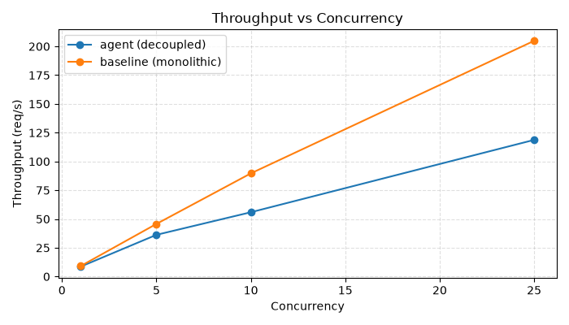
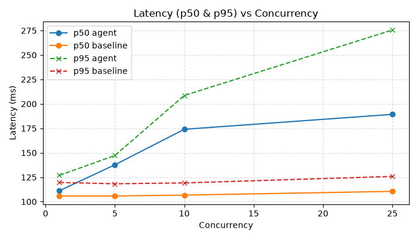

# Benchmark Results — Agent vs Baseline (2026-08-14)

This file summarizes the benchmark runs comparing the decoupled `agent-service` (localhost:8000) and the `monolithic baseline` (localhost:8002).

CSV raw data are in this folder: `bench_agent.csv`, `bench_baseline.csv`.

## Summary tables (averages across 3 repeats)

### Agent (decoupled)

| Concurrency | Throughput (req/s) | p50 (ms) | p95 (ms) | p99 (ms) | mean (ms) |
|-------------:|-------------------:|---------:|---------:|---------:|----------:|
| 1 | 8.6793 | 111.15 | 126.92 | 134.35 | 115.09 |
| 5 | 36.2334 | 137.70 | 147.20 | 173.36 | 137.06 |
| 10 | 55.8699 | 174.02 | 208.63 | 210.87 | 176.45 |
| 25 | 118.7333 | 189.29 | 275.57 | 278.92 | 195.46 |

### Baseline (monolithic)

| Concurrency | Throughput (req/s) | p50 (ms) | p95 (ms) | p99 (ms) | mean (ms) |
|-------------:|-------------------:|---------:|---------:|---------:|----------:|
| 1 | 9.2119 | 105.66 | 120.27 | 124.65 | 108.41 |
| 5 | 45.4210 | 105.67 | 120.91 | 126.67 | 108.36 |
| 10 | 88.4087 | 106.97 | 120.97 | 126.36 | 108.90 |
| 25 | 201.0277 | 112.63 | 125.45 | 126.96 | 113.62 |

## Observations

- The monolithic baseline consistently achieves higher throughput and lower latencies across all tested concurrencies.
- The performance gap widens with higher concurrency, indicating the decoupled design introduces inter-service overhead (network + HTTP + serialization) that impacts throughput and tail latency.
- For `agent-service` p95/p99 values increase markedly at higher concurrency, suggesting tail latency sensitivity in the decoupled path.

## Plots (embedded)

Throughput vs Concurrency:

Latency (p50 & p95) vs Concurrency:

## Next steps

- Run additional experiments: increase `TOOL_SLEEP_MS` to simulate slower tools, then verify whether scaling `tool-service` (HPA) recovers throughput.
- Route traces through the `observability` collector and add trace completeness checks.
